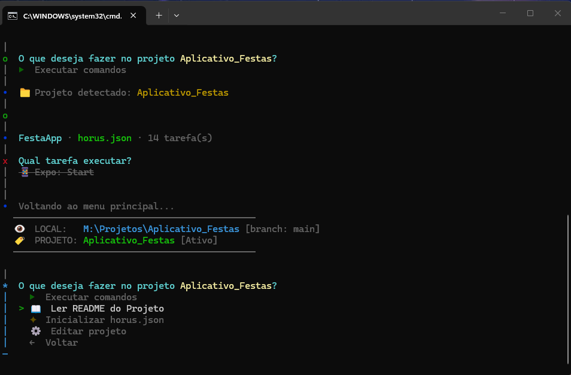

Prompt que eu gerei --------------------

# Melhoria nos projetos

## 1. Quero que na tela de tarefas do projeto, tenha na parte de cima um texto dentro de uma caixa com **instructions** sobre os comandos do projeto(Esse texto deve ser gerado pela IA automatica ou pela skill ou pelo usuario(Copiando um prompt)) 
- Para gerar esse novo texto, quero que ele fique dentro do horus.json, dentro de cada projeto. Ai o HORUS irá ler, junto com os comandos:
    - Exemplo: {
  "name": "Concursor",
  "description": "Ecossistema de resumos para concursos, automatiza a criação de 'Colas de Revisão' em DOCX.",
  **"instructions": "TEXTO DE INFORMAÇÕES PARA AJUDAR O USUÁRIO NA TELA DE COMANDOS", (NOVO)**
  "tasks": [
    {
      "label": "🚀 Iniciar Concursor (Python)",
      "cmd": "python concursor.py",
      "hint": "Inicia o ecossistema principal do Concursor para automação de resumos.",
      "group": "Essential"
    },
    {
      ......,
    }
  ]
}

## 2. Teremos que atualizar a skill @horus-init, para que ela, alem de criar os comandos dentro do horus.json, ele também crie a 
**"instructions"** dentro do horus.json, com um texto de instruções sobre os comandos do projeto(Esse texto deve ser gerado pela IA automatica ou pela skill ou pelo usuario(Copiando um prompt))

## 3.Nessa parte, no menu do projeto, () quero que em vez de ler README do projeto:
 - Tenha ler documentos do projeto:
    - Ai de para eu adicionar documentos do projeto para ler, deletar do horus o documento ou editar o documento.

Prompt que o gerador de prompt gerou --------------------

<Skills>
[Skills sugeridas]
* **Validação de Dados**: Utilize `@typescript-expert` para modelar o schema com Zod, garantindo que o campo `"instructions"` seja validado no runtime.
* **Interface Visual**: Aplique `@clack-cli-expert` para construir a caixa de instruções e os menus de CRUD, mantendo o minimalismo visual.
* **Inteligência de Inicialização**: Use `@horus-init` para expandir a detecção de stack e geração de texto de ajuda.
* **Estrutura e Velocidade**: Utilize `@architecture` para o design modular do submódulo de documentos e garantir a performance de boot.
* **Manipulação e Segurança**: Empregue `@security-auditor` para revisar a lógica de persistência e garantir que a edição de documentos não exponha vulnerabilidades.
* **Estruturação de Texto**: Utilize `@doc-coauthoring` para garantir que as instruções geradas pela IA tenham fluidez técnica.
</Skills>

<contexto_arquitetural>
O objetivo é evoluir a interface e a estrutura de dados do Horus CLI para reduzir a carga cognitiva do usuário. As melhorias focam na inclusão de metadados de instrução diretamente no contrato horus.json e na transformação do leitor de README em um sistema dinâmico de gestão de documentos do projeto.
</contexto_arquitetural>

<análise_técnica>
1. Refatoração do Schema: O campo "instructions" deve ser adicionado como opcional na raiz do horus.json e validado via Zod para garantir integridade.
2. Evolução da Skill horus-init: A lógica de Smart Init (IA) deve ser expandida para analisar o contexto global do projeto e sintetizar um texto de ajuda conciso para o novo campo.
3. Arquitetura de Documentos: Substituição da leitura estática por um módulo de CRUD documental que interage com o diretório .horus/docs ou referências no JSON, utilizando o motor de renderização Markdown nativo.
Recomendação: Implementar primeiro a mudança no schema para garantir que a atualização da skill horus-init tenha onde salvar os novos dados.
</análise_técnica>

<tarefa_principal>
**Execute:** Implemente as três melhorias estruturais no ecossistema Horus seguindo os requisitos técnicos abaixo:

1. **Injeção de Instruções no UI:**
   - Adicione o campo string `"instructions"` à raiz do objeto no arquivo `horus.json`.
   - Modifique a tela de tarefas (UI) para exibir este texto em uma caixa de destaque (Box) no topo da lista de comandos.
   - O componente deve suportar renderização automática de IA ou inserção manual via prompt.

2. **Upgrade da Skill @horus-init:**
   - Atualize a heurística de inicialização para que, além de inferir as "tasks", ela gere automaticamente o texto para o campo `"instructions"`.
   - O texto gerado deve explicar a topologia dos comandos e dar dicas rápidas de uso baseadas na stack detectada (Resumidamente).

3. **Gestão de Documentação Dinâmica:**
   - No menu do projeto, substitua a opção "Ler README" por um submódulo "Documentos do Projeto".
   - Implemente as funcionalidades de: Adicionar novo documento, Deletar documento e Editar documento (usando o editor atômico integrado).
   - O sistema deve persistir essas referências de forma que o Horus possa alternar entre múltiplos documentos técnicos além do README padrão.

[CRITÉRIOS DE SUCESSO]
* O novo horus.json deve passar na validação de schema mesmo se o campo instructions estiver ausente (fallback).
* A caixa de instruções no terminal deve respeitar as cores ANSI e formatação visual do Horus.
* A edição de documentos deve utilizar o fluxo transacional (.tmp + rename) para evitar corrupção de arquivos.
</tarefa_principal>

<detalhes_implementação>
[PADRÕES OBRIGATÓRIOS]
* Utilize a engine transacional do Execa para qualquer operação de sistema durante a edição.
* Mantenha a performance de boot abaixo de 300ms, utilizando lazy loading para o novo módulo de documentos.
* Siga o padrão de nomenclatura CamelCase para novos campos no JSON, conforme o padrão existente.
</detalhes_implementação>

<edge_cases>
* Caso o texto de "instructions" seja muito longo, implemente um scroll na box superior para não "quebrar" a lista de tarefas.
</edge_cases>